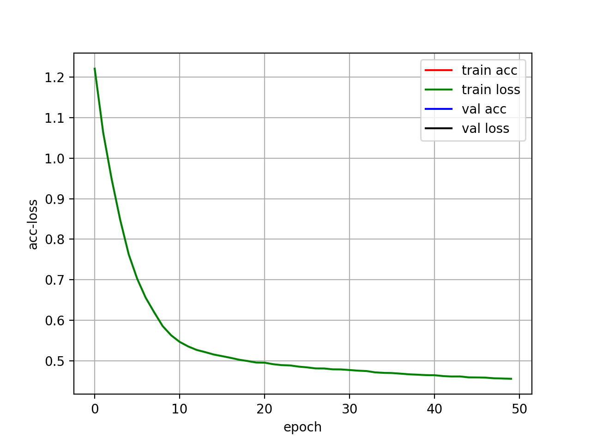

# 波士顿房价预测
线性回归

首先，波士顿房价的数据集比较小，而且线性回归不太适合该数据集，所以，预测的效果并不会太好。

数据预处理方面，以 4:1 的比例划分训练集和测试集，并且进行归一化。

使用 Keras 搭建神经网络，网络结构为 1 层全连接神经网络，神经元数量为 1。优化器选择了 SGD， 损失函数选择 MSE。

开始，选择超参数 epoch=1000, batch=16 训练，发现从第50次迭代开始，loss就开始没有明显的下降。

所以，调整参数，最后选择 epoch=50, batch=64 训练，并且为了防止过拟合，调整正则化系数为 0.1。训练损失曲线如下：

最后，在测试集上的 R2 分数为 0.7909441683358446。