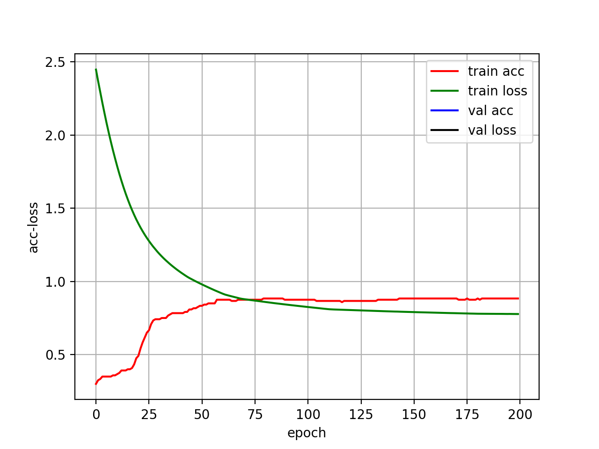
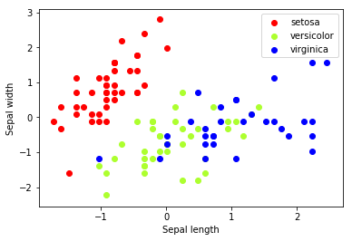

# 鸢尾花分类
线性分类

模型使用了一层全连接神经网络，神经元为3个，优化器使用 SGD，损失函数使用交叉熵。最后调整的超参数为 epoch=300, batch=32。

在调整的参数的过程中，发现训练集和测试集的划分，对最后训练的模型预测准确率很大，在最后选择的参数下，在测试集上的准确率在80%-93%波动。

猜测原因有两点：

1. 样本量小，而且样本的特征也非常少
2. 如果以对分类影响最大的萼片长度和宽度为维度，可视化查看三种花
   
   
   
   我们可以发现其实 versicolor 和 virginica 很难区分，再加上测试集数量小，一两个样本判断错误就会造成准确度产生很大的波动。